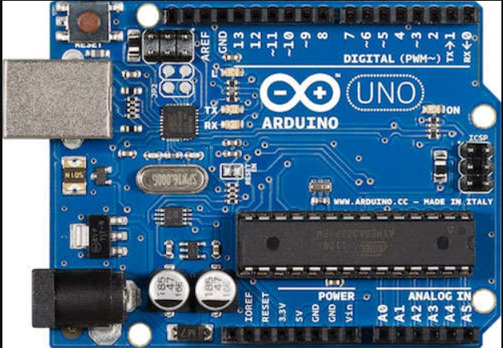
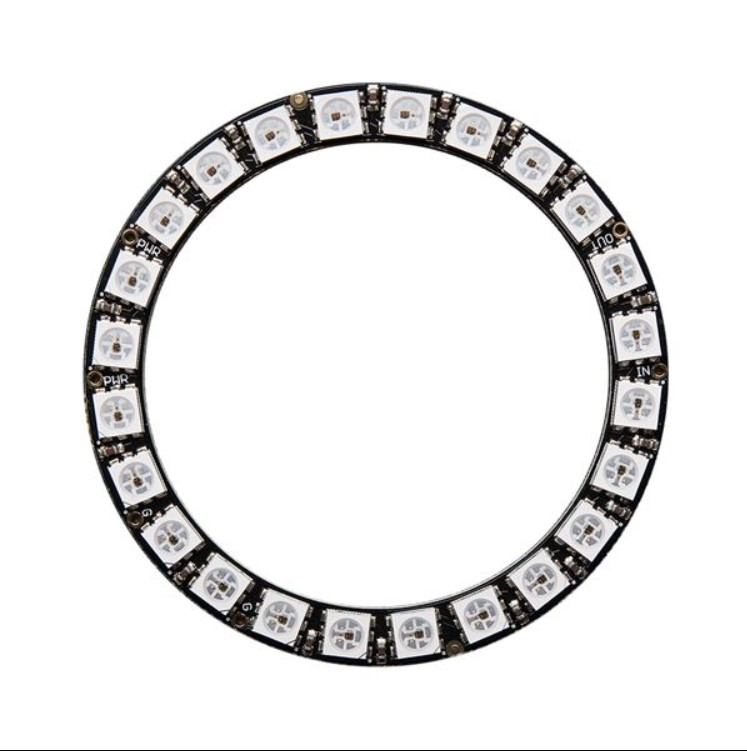
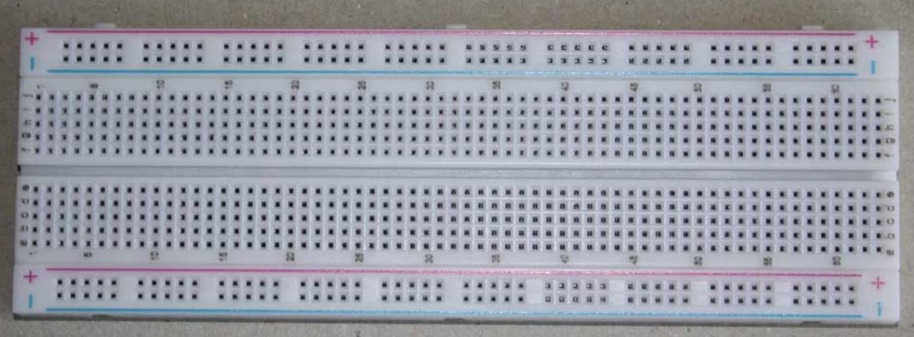
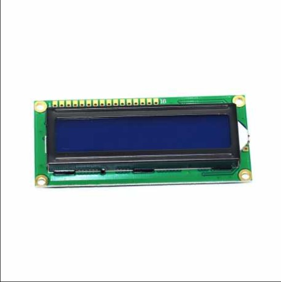
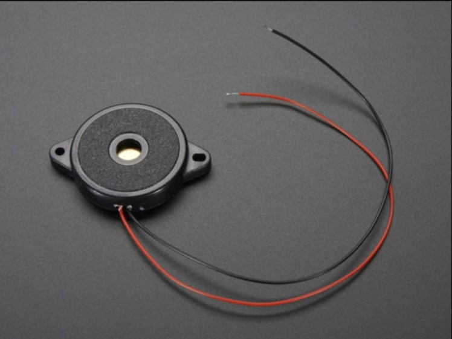
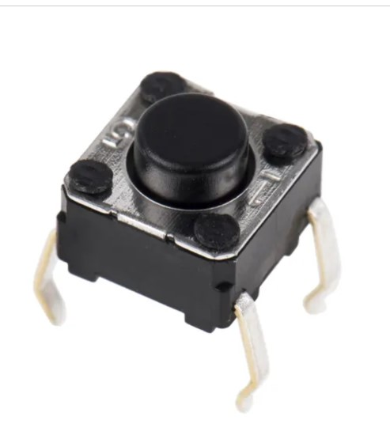

# Présentation du projet: babySens

Dans le cadre de notre projet Iot et Big Data, nous avons imaginé un tapis d'eveil "BabySens" connecté innovant pour les bébés qui pourrait contribuer au développement moteur et sensoriel du bébé tout en offrant une expérience de jeu amusante et éducative.

Le tapis serait doté de plusieurs capteurs répartis sur toute sa surface. Ces capteurs pourraient détecter les mouvements et les gestes du bébé et les traduire en actions sur le tapis, comme par exemple allumer des lumières, jouer des sons, ou projeter des images.

BabySens aura également une application qui permettra aux parents de le gerer a distance tout en gardant leurs enfant a l'oeil.

## De quoi aurions-nous besoin?

Nous aurions besoin,  initialement, d'un capteur de mouvement qui émets un son dès que le bébé est posé sur le tapis 

## Composants

* Arduino Uno R3

* Anneau 24 NeoPixels

*  Platine d'essai

* Ecran LCD 16x2

* Element piézoélectrique

* Bouton poussoir

## Authors

* Malika BOUAZIZ
* Rima BOUAZIZ
* Souad HADJ-ALI
* Sarah NAIT ABDELLAH
